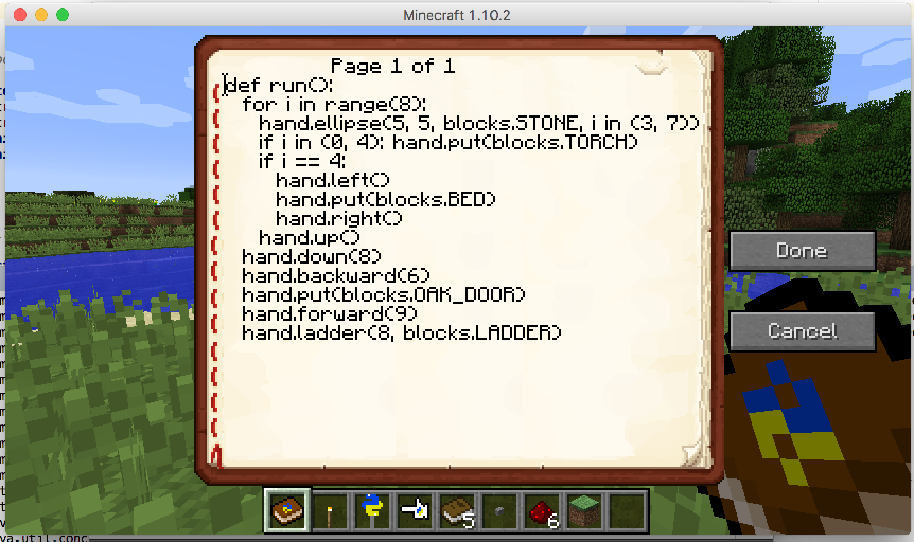
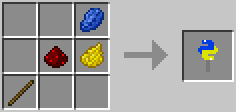
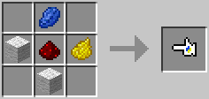
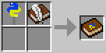

===================
Python in Minecraft
===================

I wanted to code Python stuff in Minecraft, so added a Python Block and
movable Python Hand which can be programmed with Python. The code may be
edited in-game using standard writeable books, which suck, so I also
created an extended book which provides more space, cursor and mouse
control, syntax checking and some other features.

Install using the download from https://minecraft.curseforge.com/projects/python-code

What you can do
===============

Once you've created a Python Block or Hand you can write some Python
code in a Writeable Book (or the superior Python Code Book), right click
it on a the Python Hand or Block and have that code be run.

If you want to delay the running of your code you can put all the code
in a run() function. That function will then be run only when you right
click the Python Wand on the hand or block.

Also, Python Blocks may have other events that they handle:

*Redstone Power*
   If you define a powerOn() or powerOff() function these will be called
   when the block receives, or loses redstone power (eg from redstone
   wiring, or just a button placed on the block.)
*Time Passsing*
   If you define a tick() function this will be called about 20 times
   per second.

Recipes
-------

**Python Wands** are used to create Python Code Books and interact
with Python Blocks and Python Hands:

**Python Blocks** sit in the world and can do stuff:

.. image:: screenshot/block-recipe.png

**Python Hands** can move around in the world and can do stuff.

**Python Code Book** is a superior editable book that will also check
your Python code for syntax errors:

Functionality
-------------

The Hand and Block share a bunch of functionality. For example, to make a
message appear in the in-game chat, you would use::

    chat("hello, world!")

From this point on, I will refer to the block name, but you can also
use the "hand" name here too:

``pos``
  The block-space position of the block or hand. Block space uses only
  integer (whole) numbers to locate things in the world using X
  (East/West), Y (Up/Down) and Z (North/South) coordinates. You can get a
  new pos by adding or moving the block's pos around, like::

    pos.up()
    pos.east()
    pos.add(1, 0, 4)   # East/X 1, Up/Y 0 and North/Z 4
``chat("message")``
  Have the message appear in the in-game chat.
``water(pos)``
  Have a water source be created at the position, for example
  ``water(pos.up())``. This will only work if the target position is clear.
``lava(pos)``
  Have a water source be created at the position. This will only work if
  the target position is clear.
``clear(pos)``
  Clear the block at the position nominated.
``colors``
  A list of all the standard Minecraft dye color names. Combine with
  random.choice() for fun!

  Note: using clear with the Python Block position will remove the block!

Event Handlers
~~~~~~~~~~~~~~

Both Python Blocks and Python Hands may define a ``run()`` function that
will be invoked when the block or hand is activated (right-clicked) with
the Python Wand. For example, on a block::

  def run():
    block.firework()

The player argument is optional to accept - include it if you want it::

  def run(player):
     player.chat("hello, world!")

Block
-----

Doc TBD::

    block.isPowered()           # returns boolean
    block.firework()
    block.spawn('creeper')      # ('zombie', 'skeleton')

Event Handlers
~~~~~~~~~~~~~~

Doc TBD::

  def powerOn():
    # invoked when a redstone signal powers block
  def powerOff():
    # invoked when redstone signal stops powering block
  def tick():
    # invoked every server tick (20 times a second?)
  def onPlayerWalk(player):
    # invoked when the player walks over the block
  def onEntityWalk(entity):
    # invoked when a non-player entity walks over the block

For example::

    def powerOn():
      block.firework()

or::

    def powerOn():
      block.spawn('zombie')

Players and Entities
~~~~~~~~~~~~~~~~~~~~

Players and Entities passed into onPlayerWalk / onEntityWalk have
the following methods::

  player.move(x, y, z)      # move by that amount

Living entities have the following methods::

  player.potion("jump")     # affect with a potion effect name - only living entities
                            # the REFERENCE.txt file lists potion names

Say hello::

   player.chat("hello, world!")

Example
~~~~~~~

Give the player walking over the block a speed buff or slowness nerf
depending on whether the block has redstone power or not::

   def onPlayerWalk(player):
     if block.isPowered():
       player.potion("speed")
     else:
       player.potion("slowness")

Hand
----

Doc TBD::

    hand.forward()
    hand.forward(10)
    hand.back(5)
    hand.sidle(5)           # move sideways left
    hand.reverse()
    hand.left()
    hand.right()
    hand.face(‘north’)      #  ('south', 'east', 'west')
    hand.move(x, y, z)

    # remember where the hand is and restore it after we do some things
    with hand.remember() as pos:
      hand.left()
      hand.forward(10)
    # hand is now back at pos, and has the same facing

    hand.water()   # only if clear
    hand.lava()    # only if clear
    hand.clear()

    hand.put('cobblestone')             # the REFERENCE.txt file lists block names
    hand.line(5, 'stone')
    hand.ladder(8, 'ladder')            # place a bunch of the block in a vertical line
    hand.wall(5, 3, 'planks')           # depth, height
    hand.floor(5, 5, 'stonebrick')      # width, depth
    hand.circle(5, 'stone')             # unfilled, centered on hand
    hand.circle(5, 'stone', fill=True)  # filled
    hand.ellipse(5, 10, 'stone')        # also accepts fill=True

    # beds and door special double blocks are handled
    hand.put('wooden_door')
    hand.put('bed')

    # more complex constructions
    hand.cube(5, 5, 4, 'stonebrick')    # width, height, depth; is hollow
    hand.roof(9, 9, 'oak')              # oak "hip" roof

Roof materials are oak, stone, brick, stone_brick, nether_brick, sandstone, spruce,
birch, jungle, acacia, dark_oak, quartz, red_sandstone and purpur. Technically
anything else registered with a block named "blockname" stairs name
"blockname_stairs" and "blockname_slab" will suffice, with some workarounds the mod
does for wood and stone variants of things.

Block variations are handled through keyword arguments. All of the above block-
placing functions accept the following keywords::

    # different plank types
    hand.put('plank', type='acacia')

    # different stone slab types
    hand.put('stone_slab', type='quartz', half='top')

    # if a block has orientation, it is taken from the hand's direction
    # but if there's a surface in the way we'll try to mount the thing
    # on that surface
    hand.put(8, 'torch')

    # colored blocks
    hand.put('wool', color='red')       # or 'stained_glass', 'stained_hardened_clay'

    import random
    hand.put('wool', color=random.choice(colors))

    # stairs - non 'straight' shapes are tricky to get right - they must
    # join up with another stair piece to retain their non-straight shape
    # or they will revert to straight!
    hand.put('oak_stairs', facing='left',   # or right, back, and cardinals
        half='top', shape='outer_right')

Roof styles include "hip", "gable" and "box-gable" (filled gable). To get a box gable
with overhang you could::

    hand.roof(7, 5, 'oak', style='box-gable')
    hand.sidle(1)
    hand.roof(9, 5, 'dark_oak', style='gable')

Examples
~~~~~~~~

An example making a little house::

    hand.down(1)
    hand.cube(7, 7, 5, 'planks', type='dark_oak')
    hand.up(1)
    with hand.remember():
      hand.up(4); hand.back(1); hand.sidle(1)
      hand.roof(9, 9, 'oak')
    hand.sidle(-3)
    hand.put('wooden_door')
    hand.forward(3)
    hand.put('torch')
    hand.forward()
    hand.put('bed')
    hand.left()
    hand.forward(1)
    hand.put('crafting_table')
    hand.sidle(1)
    hand.put('chest')
    hand.sidle(1)
    hand.put('furnace')

A more complete example which creates a little two-storey
tower with a door, bed and ladder from ground up to the roof.
Put each of these functions on a different page of the book::

    # page 1: the basic tower structure
    def tower():
      hand.down()
      hand.circle(5, 'cobblestone', fill=True)
      for i in range(8):
        hand.up()
        if i in (3, 7):
          hand.circle(5, 'planks', fill=True)
        hand.circle(5, 'stone')
        if i in (0, 4):
          hand.put('torch')

    # page 2: door and ladder access
    def access():
      hand.back(6)
      for i in range(3):
        hand.clear()
        hand.up()
      hand.down()
      hand.forward()
      hand.put('planks')
      hand.back()
      hand.put('torch')
      hand.forward()
      hand.down(2)
      hand.put('wooden_door')
      hand.forward(8)
      hand.ladder(8, 'ladder')

    # page 3: ground floor furnishings
    def furnish():
      hand.left()
      hand.forward(2)
      hand.put('bed')
      hand.sidle(1)
      hand.put('crafting_table')
      hand.sidle(1)
      hand.put('chest')
      hand.sidle(1)
      hand.put('furnace')

    # page 4: the complete tower
    def run():
      with hand.remember():
        tower()
      with hand.remember():
        access()
      furnish()

Roof demo::

STYLES = ["hip", "gable", "shed",
 "box-gable", "box-shed"]
hand.face('east')
for style in STYLES:
  for i in range(4):
    hand.forward(2)
    hand.roof(7, 5, 'oak', style=style)
    hand.left()
    hand.forward(2)
  hand.forward(20)

Wand
----

Invokes run() in the hand or block, if that function is defined.

CHANGELOG
=========

**1.7**
 - Added handling of plank types in put()
 - All block placement methods can now specify block variation keywords
 - Added roof()
 - Added half and type keyword argument handling for put()ing
   of slabs and stone slabs in particular
**1.6**
 - Altered the hand store/restore position methods to be a context manager
 - Added facing, half and shape and color keyword argument handling for put()
   which allows placing colored blocks (wool, glass, ...) and stairs. Also
   allows facing to be different to that of the hand when placed.
 - Added top-level "colors" list of the standard Minecraft color names
 - Hand no longer put()s things in its current position, always puts in faced
   position
 - Code is now saved with block/hand and kept with harvested items for
   restoration when placed in world again
 - The run() function may now optionally accept a player argument
**1.5**
 - Add player/entity walk event
 - Initialise Python on startup, rather than on first object use in game
**1.4**
 - Added floor(), wall() and cube()
 - Added sidle() for moving sideways
 - Correct some put() attachment oddities, is more consistent now
**1.3**
 - Replaced blocks, items and entities with string inputs.
**1.2**
 - Moved chat/lava/water/clear to be top-level functions
 - Lots of documentation
**1.1**
 - Packaging fixes (removed the .exe files from the jython redist)
**1.0**
 -  Initial release! Had the Python Code Book, Hand, Block and Wand.

Contributing
============

This mod is open source and contributors are welcomed! The project
is hosted on `github`_. If you need help with git, please let me
know!

.. _`github`: https://github.com/r1chardj0n3s/pycode-minecraft

Building This Mod
-----------------

This code follows the Minecraft Forge installation methodology. It will apply
some small patches to the vanilla MCP source code, giving you and it access 
to some of the data and functions you need to build a successful mod.

Note also that the patches are built against "unrenamed" MCP source code (aka
srgnames) - this means that you will not be able to read them directly against
normal code.

Three steps are needed to build this mod:

1. Check this git repository out:

    git clone git@github.com:r1chardj0n3s/pycode-minecraft.git

   You should probably fork your own copy of the repository on
   github and clone that rather than clone my repository directly.

2. Run the gradle setup:

    Windows: "gradlew setupDecompWorkspace"

    Linux/Mac OS: "./gradlew setupDecompWorkspace"

3. After all that finished, you're left with a choice:

   a. For eclipse, run "gradlew eclipse" (./gradlew eclipse if you are on Mac/Linux)
      then open Eclipse and switch your workspace to /eclipse/

   b. If you preffer to use IntelliJ, steps are a little different:

      http://www.minecraftforge.net/forum/index.php?topic=21354.0

If at any point you are missing libraries in your IDE, or you've run into problems
you can run "gradlew --refresh-dependencies" to refresh the local cache.

"gradlew clean" to reset everything (this does not affect your code) and then start
the processs again.

You should now be able to compile and run minecraft with this mod.

For more details update more often refer to the Forge Forums:
http://www.minecraftforge.net/forum/index.php/topic,14048.0.html

Distribution
------------

Update the version string in::

  build.gradle

Then run::

  ./gradlew build

And upload the .jar file from ``build/libs/``.

BUGS
----
- figure out what BlockStoneSlab "seamless" does, and how isDouble works?
- consider renaming the put argument "type" to "variant"?

TODO
----

This is not an exhaustive list, and should probably be put into github issues.

*editing*
 - replace vertical field cursor with area field one for consistency
 - selection-based copy / cut / paste
 - scrolling rather than paging?
 - add help button (describe key controls, mouse control)
 - blocks / items / entities listing somehow
*blocks and hands*
 - spawn error report with traceback on error
 - model replacement (OBJ)
 - inventory?
 - copy book name to hand/block
*wand*
 - bring up a REPL when activated against air?
 - REPL would want to have auto-complete
*blocks*
 - pull from inventory, push out
 - generate redstone power
 - texture map replacement
*hand*
 - more roof generation styles
 - allow roof generation to work with plain blocks as fallback
